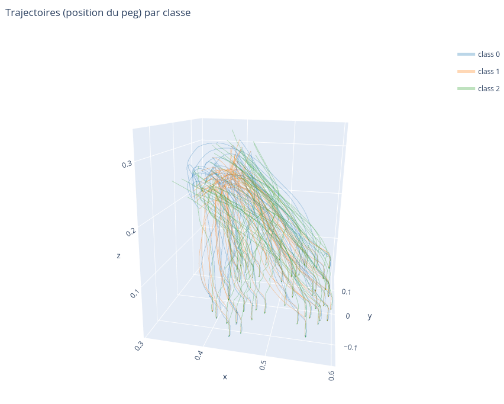
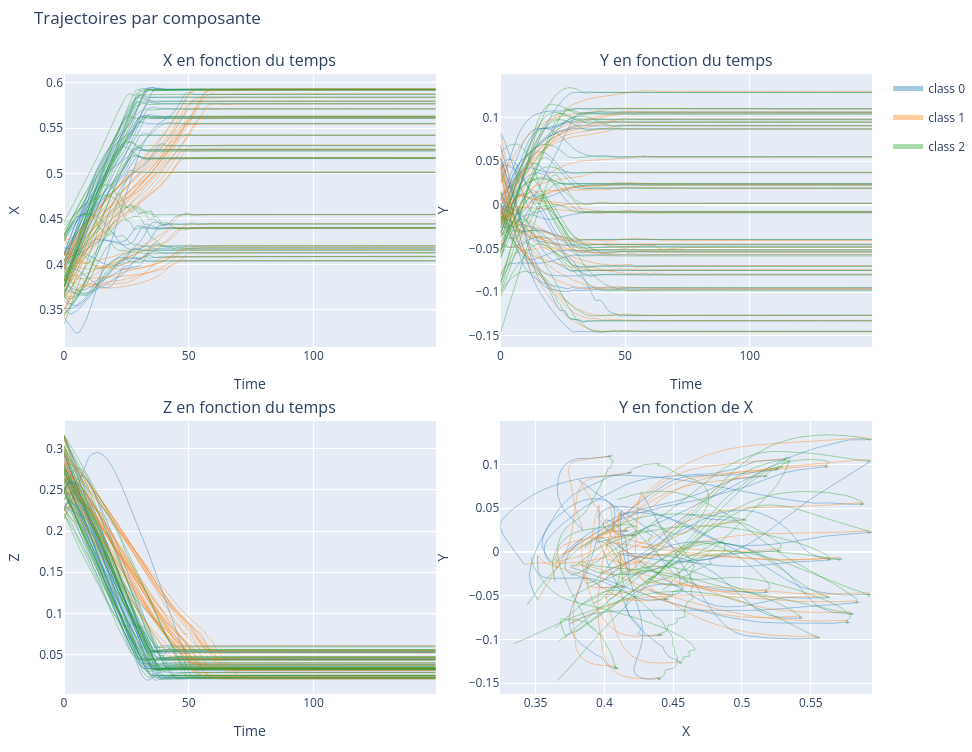
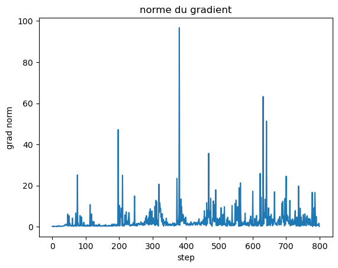
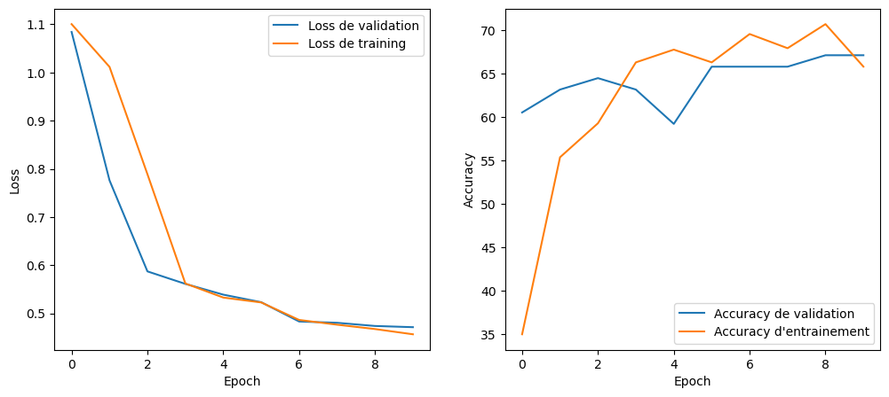
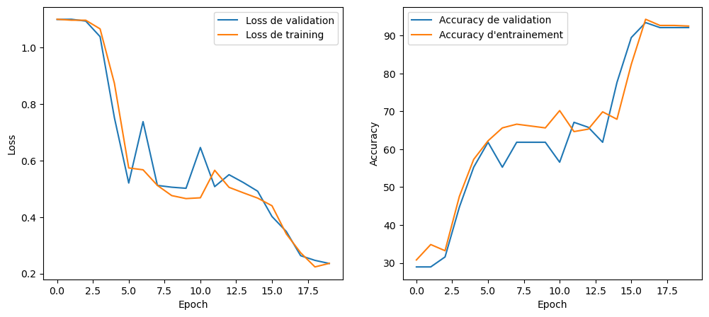
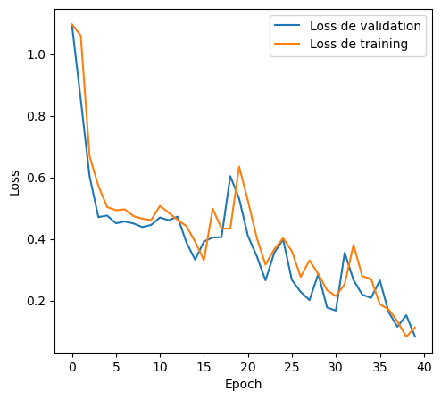
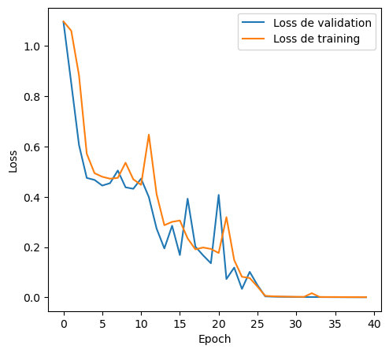

# Rapport — Classification de trajectoires par LSTM

## Objectif

Le but de ce projet est de **créer un classifieur de trajectoires** pour un bras robotique (tâche d’insertion « peg-in-hole »), à partir de séquences temporelles. Nous cherchons à prédire la **classe** d’une trajectoire (3 classes) avec un **réseau récurrent de type LSTM**.

Le notebook complet (code + figures + sorties) est fourni dans `classification.ipynb`. Ici, on ne garde que le code strictement nécessaire pour comprendre la démarche.

---

## 1. Visualisation des données (pour vérifier la séparabilité des classes)

Avant d’entraîner un modèle, on commence par **visualiser** les trajectoires, afin de vérifier (1) que les données sont cohérentes et (2) si les classes semblent séparables en observant les composantes de position.

<table>
<tr>
<td></td>
<td></td>
</tr>
</table>

On utilise une visualisation **3D (x, y, z)** et une visualisation **2D** sous forme de sous-graphes (x(t), y(t), z(t), et y(x)). Ces figures permettent de voir des motifs différents selon la classe (forme globale, dynamique temporelle), ce qui motive l’usage d’un modèle séquentiel comme un LSTM.

```python
# (extrait) Visualisation: on projette les trajectoires sur les 3 premières features (x, y, z)
traj = data[traj_idx]        # shape: (150, 20)
x, y, z = traj[:, 0], traj[:, 1], traj[:, 2]
```

Remarque: les versions interactives sont sauvegardées dans `trajectories_3d.html` et `trajectories_2d.html`.

---

## 2. Extraction et préparation des données

### 2.1 Format et contenu

Les données sont fournies sous forme de tenseurs NumPy de dimension **(n_samples, n_timesteps, n_features)**:

- `n_samples`: nombre de trajectoires
- `n_timesteps`: longueur d’une trajectoire (**150** pas de temps)
- `n_features`: dimension du vecteur d’observation (**20**)

Chaque classe contient 256 trajectoires (jeu équilibré):

- `class1_trajectories.npy`: `(256, 150, 20)`
- `class2_trajectories.npy`: `(256, 150, 20)`
- `class3_trajectories.npy`: `(256, 150, 20)`

Les 20 features sont organisées comme suit:

| Observation | Description | Taille |
|---|---|---|
| `peg_pose` | position + quaternion (x, y, z, qw, qx, qy, qz) | 7 |
| `peg_vel` | vitesse linéaire + angulaire (vx, vy, vz, wx, wy, wz) | 6 |
| `hole_pos` | position + quaternion (x, y, z, qw, qx, qy, qz) | 7 |
| **Total** |  | **20** |

### 2.2 Construction du dataset et split

On concatène les trois fichiers, puis on construit les labels:

- classe 1 → label 0
- classe 2 → label 1
- classe 3 → label 2

Le split est fait en **80% / 10% / 10%** (train / validation / test), avec un **seed** fixé pour la reproductibilité.

```python
SEED = 42
np.random.seed(SEED)
torch.manual_seed(SEED)

data = np.concatenate([data_class1, data_class2, data_class3], axis=0)  # (768, 150, 20)
labels = np.concatenate([
    np.zeros(len(data_class1)),
    np.ones(len(data_class2)),
    2 * np.ones(len(data_class3)),
])

indices = np.arange(len(data))
np.random.shuffle(indices)
train_size = int(0.8 * len(data))
val_size = int(0.1 * len(data))
test_size = len(data) - train_size - val_size
```

Dans nos données (`n_samples = 768`), cela correspond à **614** trajectoires pour l’entraînement, **76** pour la validation et **78** pour le test.

### 2.3 Normalisation (z-score)

Lors des runs finaux, on applique une **normalisation z-score** calculée sur le train, puis appliquée à val/test. On ajoute une protection sur `std` pour éviter une division par 0.

```python
train_flat = train_data.reshape(-1, train_data.shape[-1])  # (n_train*150, 20)
mean = train_flat.mean(axis=0)
std = train_flat.std(axis=0)
std = np.where(std == 0, 1e-6, std)

train_norm = (train_data - mean) / std
val_norm   = (val_data   - mean) / std
test_norm  = (test_data  - mean) / std
```

---

## 3. Le modèle (LSTM)

### 3.1 Intuition

Un LSTM est adapté ici car la classe d’une trajectoire dépend de **l’évolution temporelle** des observations, pas uniquement d’un instant isolé. Le modèle prend en entrée un tenseur `(batch, time, features)` et prédit une classe parmi 3.

### 3.2 Architecture finale

Architecture utilisée pour obtenir les meilleurs résultats:

- LSTM: `num_layers = 2`, `hidden_size = 64`
- Dropout: `0.2`
- Couche fully-connected: `Linear(64 → 3)`
- Perte: `CrossEntropyLoss`
- Optimiseur: `Adam(lr=1e-3)`
- Batch size: `32`
- Entraînement: `40` epochs

```python
class MonModele(nn.Module):
    def __init__(self, input_size=20, hidden_size=64, num_layers=2, output_size=3, dropout=0.2):
        super().__init__()
        self.lstm = nn.LSTM(input_size, hidden_size, num_layers, batch_first=True, dropout=dropout)
        self.dropout = nn.Dropout(dropout)
        self.fc = nn.Linear(hidden_size, output_size)

    def forward(self, x):
        x, _ = self.lstm(x)
        x = x[:, -1, :]           # dernier pas de temps
        x = self.dropout(x)
        return self.fc(x)
```

---

## 4. Plan d’expérience (hyperparamètres / runs)

L’objectif des différents runs était de comprendre l’impact de:

1) la **normalisation** (avec / sans z-score)  
2) la capacité du modèle (`hidden_size`)  
3) la régularisation (**dropout**)  
4) la stabilité de l’apprentissage (**exploding gradients** → gradient clipping)  
5) la reproductibilité (**seed**)  
6) le budget d’entraînement (10 / 20 / 40 epochs)

On a commencé avec une architecture simple, puis on a ajouté progressivement des mécanismes de stabilisation et de régularisation.

---

## 5. Problèmes rencontrés

### 5.1 Reproductibilité (seed)

Sans seed fixé, les splits et l’initialisation du réseau changent, ce qui rend les comparaisons de runs difficiles. On fixe donc `SEED = 42` pour stabiliser les résultats.

### 5.2 Exploding gradients (LSTM)

Lors de certains entraînements, on observe un comportement typique des RNN/LSTM: **explosion du gradient** (gradients très grands → entraînement instable). On corrige cela avec du **gradient clipping**.



```python
loss.backward()
torch.nn.utils.clip_grad_norm_(model.parameters(), 1.0)  # max_norm = 1.0
optimizer.step()
```

---

## 6. Résultats et analyse

### 6.1 Courbes d’apprentissage (loss / accuracy)

On résume ci-dessous les principaux runs (voir `rapport.ipynb` et `classification.ipynb` pour les logs complets):

#### Run 1 — LSTM simple (hidden=100) + z-score, 10 epochs (résultat médiocre)



Observations:
- performances de validation limitées et instables
- motivation pour tester une taille cachée plus faible et modifier la préparation des données

#### Run 2 — LSTM (hidden=64) sans normalisation (fort gain)



Résultat (test): **92.31%** (72/78).

#### Run 3 — Ajout du dropout (régularisation)



Résultat (test): **98.72%** (77/78).

#### Run 4 — Dropout + gradient clipping (stabilité) — meilleur modèle



Résultats (test):
- `Test loss: 0.0007`
- `Test accuracy: 100.00%`

### 6.2 Analyse globale

- Les visualisations initiales montrent des trajectoires qui diffèrent selon les classes, ce qui confirme que la classification est plausible.
- L’ajout du **seed** rend les comparaisons fiables.
- Le **dropout** améliore la généralisation (réduction du sur-apprentissage).
- Le **gradient clipping** stabilise l’entraînement et corrige le problème d’exploding gradients, ce qui permet d’atteindre une performance parfaite sur le test interne.

---

## 7. Conclusion et perspectives

Nous avons construit un classifieur de trajectoires basé sur un **LSTM** qui atteint **100% de réussite sur l’évaluation (test set interne)** après stabilisation de l’entraînement via **gradient clipping** et régularisation par **dropout**.

Perspectives possibles:
- tester une **sélection de features** (par exemple uniquement pose/vitesse ou uniquement position) pour étudier l’influence du nombre de features
- ajouter une **data augmentation** cohérente (bruit faible, jitter temporel) sans déformer la physique
- valider sur un **jeu de test externe** (celui fourni par l’enseignant) avec la fonction d’évaluation du notebook
